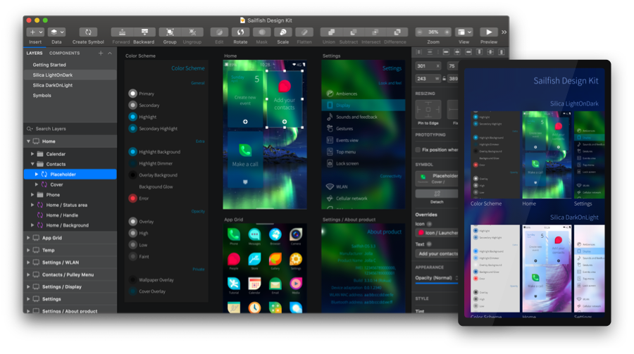

<div align="center">
    
    <h3 align="center">Sapphire</h3>
    <p>Unofficial Sketch Mirror client for Sailfish OS</p>
</div>

## About

Sapphire is a companion for [Sketch] app and was built to let you preview designs from the Mac on your Sailfish OS devices over Wi-Fi.




## Contributing

Stick to [Sailfish OS Coding Conventions] when writing new code.

For C++ code you may use clang-format, like this:

```bash
clang-format-9 --sort-includes -i **/*.cpp **/*.h
```

Note that clang-format doesn't formats `connect()` properly.
E.g. code should be formatted as:

```c++
connect(sender, &MySender::valueChanged,
        receiver, &MyReciever::updateValue);
```

but clang-format gives us this:

```c++
connect(sender,
        &MySender::valueChanged,
        receiver,
        &MyReciever::updateValue);
```

So, don't trust it about automatic `connect()` format changes.


## TODO

- [ ] add some animation to show user what to do in Sketch to authorize incoming connection
- [ ] speedup artboards update by requesting only damage area
- [ ] implement search
- [ ] prototypying support
- [ ] offline documents


## License

Sapphire is provided under the [GPLv2](LICENSE).


[Sailfish OS Coding Conventions]: https://sailfishos.org/wiki/Coding_Conventions
[Sketch]: https://www.sketch.com/
